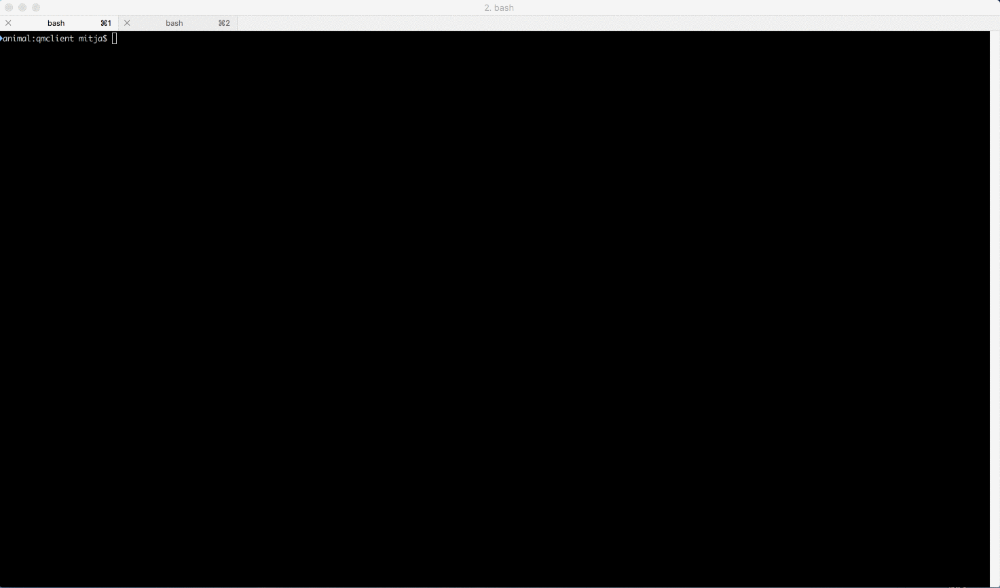

# Queue Manager
Simple thread safe Queue Manager implementation in Go, with command line tools.
This is just a proof of concept and it **should not be used** in real application/project.

## Overview
Service contains stores for each task state. With client/worker manipulation tasks are moved between them.

RPC connector enables client and processor to access queue manager to send and receive tasks.
HTTP connector enables user to see basic Queue manager statistics, with list of finished tasks.


### Libraries
Service uses two, Golang supplementary cryptography SDK libraries, as it is never good idea to implement your own cryptography.
- [blowfish](https://godoc.org/golang.org/x/crypto/blowfish)
- [bcrypt](https://godoc.org/golang.org/x/crypto/bcrypt)

### Possible improvements
- multi level logging
- add persistent store
- influx/grafana monitoring
- multiple access points (REST/RPC)
- improvements with 3d party libraries (UUID, mocks, testing)
- more detailed error handling
- RPC multiplexing
- nicer and more detailed Web interface (not only statistics)
- dynamic load of operations

## Running it in docker
To run it in Docker:

~~~
make run-docker
~~~

This will start Queue manager and expose port 8080 and 8090 for HTTP and RPC request. You can open web interface on
[http://localhost:8080/](http://localhost:8080/) and see current statistics.

## Running simulation in docker
To run simulation in Docker:

~~~
make run-simulator-docker
~~~

This will start Queue manager and simulator in docker and expose port 8080 and 8090 for HTTP and RPC requests.
You can open web interface on [http://localhost:8080/](http://localhost:8080/) and see current statistics and progress.

## Installation

Queue manager only:
```bash
go get -u github.com/mitjaziv/qmanager/cmd/qmanager
```

All command line tools:
```bash
go get -u github.com/mitjaziv/qmanager/cmd/...
```

## Usage
Usage is described in command line section for each command in details.

## Worker registration in clients
Worker library enables you to implement your own operations and register them with callback factory. Client tool would
need to be expanded to support any kind of operation. But as operations always need to be implemented I did not at support for this right now.

```Go
// Caller structure and function for specific operation
type SomeOperation struct {
}

func (s *SomeOperation) Call(t *Task) error {
    // Task for operation
    var result := something(t.Input)
    
    // Write fibonacci number to output
    t.Output = result
    
    return nil
}

// Create callback factory
cbFactory := worker.NewCallbackFactory().
    Register(&SomeOperation{}, "someoperation")
    
// Create worker and start processing
w, err := worker.NewWorker(
    cbFactory,
    worker.Host(host),  // optional
    worker.Delay(time.Second*duration), // optional
)
if err != nil {
    log.Fatalln(err)
}
w.StartProcessing()
```

## Screenshoots


## Command line tools

| Command                         | Description                                                         |
|:--------------------------------|:--------------------------------------------------------------------|
| [qmanager](cmd/qmanager/)       | Queue Manager main service.                                         |
| [qmclient](cmd/qmclient/)       | Tool for adding and reading tasks in Queue.                         |
| [qmsimulator](cmd/qmsimulator/) | Simulator demonstration tool which adds and process tasks in Queue. |
| [qmworker](cmd/qmworker/)       | Worker tool which processes registered tasks in Queue.              |

#### Screenshoots
qmclient:

qmsimulator:

qmworker:


License
-------

[WTFPL]()
